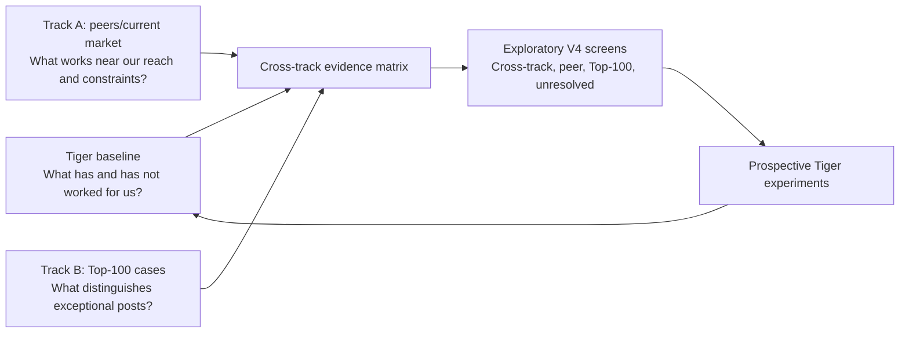

# LinkedIn V4 Pilot — Stage 0 Research Specification

**Date:** 2026-07-28
**Status:** Executed through normalization and observational synthesis; coverage limits remain explicit
**Recorded Apify spend:** $5.066 across 31 Actor executions (30 data-producing; one charged limit-terminated execution), below the $8.25 hard stop and the user's €10 ceiling
**Production impact:** supplies an evidence-ranked experiment queue and guardrails for the six-week V4 pilot; it does not establish causal winner rules

## Decision in One Sentence

V4 will triangulate Tiger's own account, a near-peer/current-market sample, and the Top-100 curated-success cases; no one evidence layer is allowed to substitute for the other two.

## Executed-Study Decision — 2026-07-28

Tiger authorized the full Stage-0 collection within the earlier €10 ceiling. The study collected
profile and post-history data, preserved raw Actor results, normalized repost wrappers without
double-counting, joined the Tiger public census, built within-creator outcomes and matched
controls, and produced a visible evidence matrix and Scout Queue.

The critical result is not a list of winning topics. It is a set of boundaries:

- Tiger has 58 mature public originals in the fixed window; all 50 private Top-Posts rows reconcile deterministically, while the private workbook remains a ranked subset rather than a census;
- 10 of 30 peer candidates mechanically pass the frozen cadence gate, 14 are left-censored by the 30-activity cap, five observably fail, and one has missing history;
- the planned 24-person `12 near / 6 growing / 6 established` design cannot be filled from the current pool—even if every unresolved history later passes, the maximum is 19;
- 73 of 100 Top-100 reference rows are present as 72 unique canonical posts; 27 remain absent, including 16 with known exact URLs;
- a final 16-URL recovery call was refused by Apify's account monthly usage hard limit before a run was created, so no missing outcome is imputed;
- 42 Top-100 cases have at least ten usable same-author baseline posts and enter the quantitative lane; the rest remain descriptive;
- no mechanic passed the cross-track threshold for `portable V4 hypothesis` status;
- observable-feature machine codes and Scout Queue screens remain exploratory because the separate blind reliability check failed its freeze gate and its coding-pass provenance is incomplete.
- 15 problem-job-artifact combinations met the mechanical `screen_A` rule, but none is a validated topic without manual pain, proof, artifact, and Tiger-source review.

The six-week prospective Tiger pilot in `v4-audience-growth-operating-system.md` is therefore the
next evidence-producing step. It tests a narrow set of heuristic peer and curated-success signals
on Tiger's actual reach rather than hard-coding them as universal creator rules.

## Evidence Architecture



| Evidence layer | Primary job | Metric source |
|---|---|---|
| Tiger baseline | Diagnose the current account | private post-level analytics where available, plus public post history |
| Track A — peers/current market | Establish present-day base rates and near-peer transferability | public within-creator response |
| Track B — Top-100 cases | Reverse-engineer curated successful posts against the same creators' normal work | exact reference posts plus matched same-author controls |
| Tiger experiments — later | Validate transfer and resource demand | impressions, reach, engagement, followers, visits, downloads, and usage |

## Four Design Rules

1. **Keep the layers independent until synthesis.** Track A is not selected from Top-100 performance, and Top-100 frequency is not treated as a market base rate.
2. **Normalize before comparing.** A 100,000-follower creator is not direct evidence for a 1,500-follower account. Results are measured within creator, then compared by follower stratum.
3. **Code before seeing outcomes.** Content and visual mechanics are coded with creator, track, follower count, and performance hidden.
4. **Extract once, preserve every provenance.** When a creator appears in both tracks or multiple references, scrape the profile/history once but retain all track and reference labels.

## Research Questions

### Tiger baseline

What has and has not moved impressions and engagement on Tiger's current account, and which mechanics are missing from his current body of work?

### Track A — peers/current market

Which problems, promises, proof types, artifacts, and visual structures repeatedly beat each creator's own baseline, especially for accounts near Tiger's current size?

### Track B — Top-100 curated successes

What distinguishes the known-success references from comparable ordinary posts by the same creators, and which observable mechanics recur across domains?

### Combined V4 question

> Which problem–promise–proof–artifact combinations are exceptional in curated winners, repeatable among current practitioners, visible on small accounts, and realistically producible by Shetty's Desk?

## Intelligence Scout — What We Will Learn to Focus On

The pilot is not only a post-performance study. It is also a scouting system for deciding **which people, work problems, domains, AI roles, and proof artifacts deserve production attention**. Every candidate signal enters the `Scout Queue` in the control workbook with its provenance intact.

The scout watches five evidence lanes:

1. **Audience pain:** a concrete planning, purchasing, logistics, or transformation decision with visible stakes.
2. **Near-peer repeatability:** the same problem or delivery mechanic performs above more than one comparable creator's own baseline.
3. **Curated-success exceptionality:** the mechanic is present in a Top-100 case and its public response exceeds the same author's ordinary work under the automated heuristic comparison.
4. **Public proof path:** the claim can be demonstrated with authoritative public data, standards, research, formulas, or a transparent synthetic example.
5. **Artifact feasibility:** Codex can turn the insight into something inspectable or runnable, such as a calculator, workbook, dashboard, decision board, map, checklist, benchmark, or validated workflow.

Controlled scouting dimensions include:

- audience role: planner, planning manager, purchasing practitioner, procurement leader, SCM transformation leader, or cross-role;
- operating domain: demand/supply planning, inventory, logistics, sourcing, supplier management, S&OP/IBP, process improvement, or data/transformation;
- AI role: research, extraction, diagnosis, analysis, optimization, recommendation, automation, validation, or communication;
- proof type: public dataset, standard, peer-reviewed research, formula/model, documented operating method, or inspectable worked example;
- people signal: repeatable near-peer creator, exceptional Top-100 creator, credible source expert, or potential distribution partner.

No opaque opportunity score is used. The generated Scout Queue is a **discovery screen**, not a
topic ranking or evidence gate. `screen_A` means the same provisional problem-job-artifact
combination appears in at least two posts from at least two creators and is visible in at least two
independent evidence layers; `screen_B` means it does not meet that screen. Because the meaning
taxonomy failed reliability, neither status validates the labels. A separate manual topic-admission
review must still establish target-audience pain, primary or authoritative proof, a useful artifact
path, Tiger's contribution, and an explicit validation check. Generic AI news, status-dependent
posts, and topics with no defensible work output are rejected even when visually attractive.

## Non-Goals

This pilot will not:

- identify the “best” LinkedIn creators;
- claim causality from observational data;
- use raw reactions to rank people with different audience sizes;
- use public interactions as if they were impressions or reach;
- collapse the three evidence layers into one opaque score or leaderboard;
- scrape commenters, reactors, personal emails, or private data;
- let the current calendar or our favorite examples decide the answer;
- redesign the production workflow before the evidence is reviewed.

## What Existing Material Can and Cannot Prove

### Tiger's analytics

Canonical source:

`/Users/tigershetty/Downloads/AggregateAnalytics_Poornajith Shetty_2026-02-15_2026-07-27-2.xlsx`

The workbook without the `-2` suffix is a duplicate at the visible-cell level and will not be used as a second observation. The later `-2` export is the canonical truth source for Tiger's available private metrics. Its `TOP POSTS` sheet contains a limited ranked post set rather than a confirmed all-post ledger, so it cannot by itself establish failure prevalence. Tiger's public post history will supply the content census; private impressions and engagements are joined only where an exact post match exists. Missing private outcomes remain missing.

### Top-100 references

`top 100/Reference File and Caption.xlsx` is the seed for a curated-success case track. It contains 100 reference rows, 99 non-empty captions, and 97 available local assets. References 1 and 63 are duplicates. The workbook does not contain consistent author URLs, publication dates, or outcome fields, so every case must first be resolved to the original LinkedIn post.

Use the Top-100 as:

- a census of curated successful posts, not 100 assumed creators;
- a source of exceptional content and visual cases;
- a starting label that must be checked against the creator's contemporaneous baseline;
- a cross-domain source of observable mechanics and one-variable test ideas.

Do not infer that:

- a frequent Top-100 pattern caused success;
- the person named on an image is necessarily the posting author;
- every reference is independent when creators and posts repeat;
- inclusion provides a numerical rank without the original selection metric.

For each row, resolve the posting author, credited/source creator, original visual owner, exact post URL, and confidence separately. Preserve unresolved values rather than guessing. Inside the pilot, replace “reference-proven” with either **curated-winner pattern** or **mechanic hypothesis**, depending on the claim.

### Existing benchmark and script

`linkedin-creator-benchmark-50-2026.md` is a curated benchmark cohort, not an authoritative ranking. `scripts/apify-sc-benchmark.mjs` mixes hashtag discovery and profile sampling through an older Actor. It remains untouched for historical context but is not the V4 pilot method.

### Stage 0 control workbook

`outputs/linkedin-v4-stage0-2026-07-27/linkedin-v4-stage0-research-control.xlsx` is the frozen pre-run control. The completed control is stored inside the dated full-study package under the active thread output directory. It adds the run ledger, actual spend, creator coverage states, Top-100 recovery registry, outcome joins, matches, evidence classifications, reliability result, Scout Queue, and completion sign-off. Neither workbook replaces the raw source files.

The free-resolution checkpoint had 97 posting authors, 89 exact original post URLs, 30 peer candidates, and 81 unique external author entities after normalization and overlap removal. The paid corpus recovered 73 reference rows rather than all 89 known URLs. That difference is recorded at the row level; it is not treated as silent success.

## Track A — Peer and Current-Market Sample

### Cohorts

The original 24-person manifest remains the seed inventory; the executed Track A/current-market
pool is the expanded 30-candidate manifest below. The intended design retains three equal subject
cohorts, but the paid cadence gate did not produce an eligible 24-person panel:

| Cohort | What belongs | What does not |
|---|---|---|
| Planning and logistics | forecasting, demand/supply planning, inventory, S&OP/IBP, logistics operations | generic supply-chain news with no practitioner teaching system |
| Purchasing and procurement | sourcing, purchasing, spend, supplier decisions, procurement transformation | recruitment-first or vendor-first accounts whose teaching is incidental |
| Implementation-adjacent | AI workflows, Excel/BI, Lean/process improvement, Copilot/Power Platform | generic AI news, motivation, creator marketing, or leadership with no operating method |

The third cohort is deliberately narrow. Broad B2B creators such as Eric Partaker, Amanda Natividad, Shreyas Doshi, and Wil Reynolds may remain qualitative references, but they will not consume paid pilot rows.

### Size cells

Because Tiger currently has roughly 1,500 followers, the primary peer comparison must be deliberately concentrated near that level. The target per subject cohort is:

- four near-peer creators at approximately 500–5,000 followers;
- two growing creators above 5,000 and up to 20,000 followers;
- two established comparators above 20,000 followers.

That target would produce 12 near peers, six growing creators, and six established comparators across Track A. It remains the intended design, not the achieved panel: the executed corpus supports 20 radar, 15 decision, and 10 strict creators, with left-censoring and failures preserved explicitly rather than relabelled as 24 eligible creators.

Candidate manifest: `linkedin-v4-stage0-creator-pool.csv`

The expanded manifest contains 30 candidates and reached the 12-account near-peer **candidate**
target. Paid profiles replaced approximate follower snapshots for strata. The executed history gate
confirmed only 10 strict cadence passes overall; the candidate balance did not become an eligible
24-person panel. Established candidates displaced by rebalancing remain documented reserves; prior
research is not deleted.

### Stage 0 near-peer additions — public reconnaissance

Six independently discovered candidates complete the **candidate** balance at four near peers per cohort. They remain provisional until the outcome-blind eligibility gate confirms at least 20 English original posts inside the fixed window.

| Cohort | Candidate | Public snapshot on 2026-07-27 | Why the candidate is useful |
|---|---|---:|---|
| Planning/logistics | [Mary Kate Kloeblen](https://www.linkedin.com/in/mary-kate-kloeblen-16052225) | [4,009 followers; 215 posts](https://www.linkedin.com/posts/mary-kate-kloeblen-16052225_ive-been-quiet-on-linkedin-for-the-last-activity-7391466987106959362-2oOz) | First-person CPG inventory, fulfillment, packaging-cost, and 3PL decisions |
| Planning/logistics | [John Kloetzing](https://www.linkedin.com/in/john-kloetzing) | [about 1,367 followers](https://de.linkedin.com/in/john-kloetzing/de) | Practitioner-led IBP, scenario planning, pharma constraints, working capital, and AI decision architecture |
| Purchasing/procurement | [Nikhil Tripathi](https://www.linkedin.com/in/tripathinikhil) | [4,623 followers; 260 posts](https://www.linkedin.com/posts/tripathinikhil_i-believe-the-procurement-of-the-future-is-activity-7480091795729670144-bSA1) | Procurement transformation, AI readiness, sourcing, and stakeholder influence |
| Purchasing/procurement | [John Kill](https://www.linkedin.com/in/johnckill) | [3,067 followers; 155 posts](https://www.linkedin.com/posts/johnckill_supplychain-manufacturing-procurement-activity-7472634249070747648-Pp6d) | Manufacturing procurement, reshoring, supplier criticality, spend visibility, and resilience |
| Implementation-adjacent | [Stuart Hardman](https://www.linkedin.com/in/stuart-hardman) | [about 978 followers; 151 posts](https://www.linkedin.com/posts/stuart-hardman_businesscentral-msdyn365bc-erp-activity-7448309075483873280-bA78) | ERP, Business Central, Copilot, Excel/OneDrive workflows, and operational controls |
| Implementation-adjacent | [Niranjan Kulkarni](https://www.linkedin.com/in/niranjan-kulkarni-pk) | [4,627 followers; 360 posts](https://www.linkedin.com/posts/niranjan-kulkarni-pk_leansixsigma-kaizen-5s-activity-7480085692316815360-9yg6) | Practical 5S, Lean Six Sigma, bottlenecks, inventory cash flow, and manufacturing improvement |

This reconnaissance deliberately used identity, size, topic fit, cadence, and originality evidence—not interaction counts. The paid history check replaced the public-snippet estimate. Ten creators pass the mechanical cadence gate, while the other 20 remain separated into left-censored, observed-fail, and missing-history states.

### Eligibility

A creator is eligible only when the profile check confirms:

1. an individual public profile, not a company page;
2. English is the dominant publishing language;
3. exactly one preassigned cohort fits the bio and recent topic history;
4. at least 20 eligible original posts remain in the fixed window;
5. retained posts span at least eight distinct weeks;
6. at least 50% of reviewed posts are relevant to the assigned cohort;
7. no more than 50% of activity is pure reposts, vacancies, event promotion, or company announcements;
8. caption, date, native format, public interaction counts, and required media can be retrieved.

Do not exclude a creator for low engagement, weak design, lack of carousels, or small audience. Those are part of what we need to observe.

### Executed coverage states

Cadence is now reported separately from meaning-heavy content fit:

| State | Creators | Interpretation |
|---|---:|---|
| Confirmed mechanical pass | 10 | At least 20 mature originals across at least eight weeks are observed |
| Left-censored | 14 | The 30-activity cap ended after the window start; earlier qualifying posts may be missing |
| Observed fail | 5 | The returned history reaches the effective window boundary and does not meet the cadence rule |
| Missing history | 1 | Profile/followers resolved, but the post query returned no activities |

Automated topic and low-value keyword flags are review aids, not exclusion proof. The 10 confirmed
mechanical passes form the strict sensitivity panel. A 15-creator `>=15 posts / >=6 weeks`
decision panel supports broader directional screening, and a 20-creator `>=10 posts / >=4 weeks`
radar panel supports scouting. Neither relaxed panel is allowed to masquerade as the frozen
24-person design.

### Outcome-blind eligibility and balancing

Selection view may show only:

- profile URL and identity;
- headline/role;
- language;
- follower stratum;
- posting cadence and original-post share;
- subject-matter share;
- accessibility status;
- provenance and prior-exposure flag.

It must hide all post interaction counts and winner labels.

If more eligible candidates exist than a subject × size cell requires, assign each candidate a reproducible SHA-256 value from:

`SHETTYS-DESK-V4-PILOT-2026-07-27|candidate_id`

Within each cell, take the lowest hashes until the quota is filled. If a selected creator fails, continue to the next eligible hash under the same quota. The hash resolves oversupply only; it is no longer used to discard half the eligible peer sample.

## Track B — Top-100 Curated-Success Census

Track B begins with all 100 workbook rows. It does not inherit Track A's follower or subject eligibility rules because its purpose is to capture exceptional mechanics across supply chain and external fields.

### Identity resolution record

Every reference row must contain:

- `reference_id` and physical workbook row;
- full caption hash and local asset hash/path;
- duplicate group;
- actual posting author and LinkedIn profile URL;
- credited/source creator and profile URL when different;
- original visual owner or organization when identifiable;
- exact LinkedIn post URL and publication timestamp;
- resolution evidence and confidence;
- subject transfer class: direct SCM, implementation-adjacent, or external transferable;
- Track A overlap flag.

Use column A's reference number as the canonical key; do not use the physical spreadsheet row because the workbook contains a leading blank/header structure. References 1 and 63 remain as two provenance rows joined to one deduplicated post.

### Resolution gate

- inventory all 100 rows;
- group exact and near duplicates without deleting provenance;
- resolve at least 95% of posting authors;
- resolve at least 85% of exact post URLs;
- keep low-confidence or conflicting identities unresolved;
- never substitute a credited visual creator for the post author without an exact caption/post match.

All resolved unique creators may enter Track B. Repeated creators remain repeated cases, but creator-level weighting prevents a prolific author from dominating the conclusion.

### Identity and paid-corpus snapshot — 2026-07-28

- all 100 workbook rows are inventoried;
- 97 posting authors are resolved to the required confidence threshold;
- 89 exact original post URLs are resolved;
- 11 rows still lack an exact original URL; ref 6 has neither a local caption nor image, while refs 32 and 37 remain explicitly unresolved rather than guessed;
- references 1 and 63 are preserved as separate provenance rows but one deduplicated post;
- company pages, derivative reposts, and author/source/visual-owner conflicts are recorded separately;
- the paid corpus contains 73 reference rows represented by 72 unique, mature, outcome-complete canonical posts;
- 42 unique cases have at least ten usable same-author baseline posts and enter the quantitative lane;
- 30 recovered cases are descriptive-only under the frozen baseline rule;
- 27 reference rows are absent from the corpus: 16 have known exact URLs and 11 still lack a resolved URL;
- the final exact-URL retry was blocked before run creation by Apify's monthly usage hard limit.

Both Stage 0B identity thresholds were reached, but identity resolution is not the same as paid
outcome recovery. Every missing case stays visible in `top100-resolution.csv`; reaching the identity
threshold does not convert an absent case into evidence.

The recovered Top-100 set is also format-skewed: 71 of 72 unique posts are reported as single
images and one as an article. Five apparent single-image cases have multi-frame local GIF assets,
and two recovered cases lack local assets. The clean local visual-comparison lane is therefore 63
unique personal static cases. Top-100 may inform image mechanics inside that lane; it cannot prove
that static images outperform documents, galleries, video, text, or quotes.

## Tiger Baseline Sample

Tiger's public posts use the same content codebook as both external tracks. The primary date window matches Track A. Private outcomes are joined by exact post identity only.

- Include every retrievable mature original post in the fixed window.
- Join private impressions and engagements from the canonical workbook where available.
- Retain public interaction counts for posts without a private match.
- Label the private `TOP POSTS` subset explicitly; do not treat missing lower-ranked posts as zero-impression failures.
- Do not expose Tiger outcomes or track identity during blind coding.

### Current Tiger export snapshot — 2026-07-27

The two supplied analytics workbooks contain identical worksheet data; the later `-2.xlsx` export is the canonical control copy. It records:

- 331,745 overall impressions;
- 191,166 members reached;
- 1,510 followers at export time;
- 50 unique posts in the joined `TOP POSTS` rankings;
- 49 of those 50 published by the July 13 maturity cutoff.

The export's two Top-50 rankings contain the same 50 post URLs, so impressions and engagements are paired for that ranked subset. It is still not a complete post census. The user-reported live count of 1,512 and the exported count of 1,510 are retained as a two-follower timing/interface discrepancy, not silently reconciled. `Tiger Daily`, `Tiger Audience`, and the post-level ranked subset are preserved in the Stage 0 control workbook. The completed public extraction contributes 60 rows and 58 mature originals in the fixed window; eight mature public posts sit outside the private ranked subset.

The preliminary distribution is highly concentrated: the highest-impression post contributes 53.2% of the export-period impressions, the top three contribute 78.9%, and the top five contribute 85.4%. This establishes an outlier-dependence problem; it does not establish why those posts won. That causal question is reserved for blind content coding and the peer/Top-100 comparisons.

## Post Windows and Eligibility

### Tiger and Track A

- Earliest publication: `2026-02-15T00:00:00+01:00`
- Latest publication: `2026-07-14T23:59:59+02:00`
- Reason for July 14 cutoff: every retained post is labelled mature as of the July 28 research date.
- Retention: every eligible original returned inside the fixed window; do not truncate a 28-post creator to an arbitrary 25.
- Retrieval target: up to 30 chronological activities per creator. When the 30-activity cap ends after the window start, label the history `left_censored`; do not call the creator ineligible or silently extend the scrape.

### Include

- low- and zero-interaction posts;
- all supported native formats;
- promotional, personal, giveaway, and news-dependent posts, coded honestly;
- quote posts with at least 40 words of original commentary and an independent argument.

### Exclude

- pure reposts/reshares;
- duplicate or near-identical posts from the same author, retaining the earliest;
- sponsored/paid placements when identifiable;
- non-English posts;
- posts outside the fixed window or under 14 days old;
- deleted or unavailable posts;
- posts whose caption or required attachment cannot be retrieved well enough to code;
- comments, replies, and company-page posts.

Promotional, personal, and news-dependent winners can reveal a performance mechanism. They cannot become a transferable Shetty's Desk system unless the same signal appears in non-dependent content.

### Track B reference cases and baselines

- Always retain the exact resolved reference post when it is at least 14 days old.
- Retrieve up to 30 chronological original posts for each unique author, deduplicated against Track A.
- Build the contemporaneous baseline from up to 20 eligible posts nearest the reference date, preferably within ±120 days.
- Exclude every other Top-100 case from that reference's control pool.
- Fewer than ten usable baseline posts makes the case descriptive-only.
- If a reference post is under 14 days old, retain its content coding but exclude it from primary outcome comparison until mature.

Track B is not forced into the February–July window. Its control window follows the exact case date so follower growth, topic timing, and algorithm conditions are less mismatched.

## Outcome-Blind Coding

The shared core dimensions proposed for freeze are:

1. audience specificity;
2. entry hook;
3. job promised;
4. primary proof;
5. primary artifact;
6. native platform format;
7. primary CTA;
8. content class.

Four V4 modules are added without collapsing them into one score:

9. problem family;
10. primary visual structure;
11. operational completeness: inputs, steps, output, and validation as separate yes/no fields;
12. distribution dependency: evergreen, timely/news, promotion, personal authority, and comment gate as separate flags.

Definitions, edge rules, and the reliability gate are in `linkedin-v4-stage0-codebook-v1.md`.

Mix Tiger, Track A, Top-100 cases, and controls under randomized post IDs. Coders must not see creator identity, follower count, track membership, case/control status, or outcomes. Visual structures such as ladders, decision trees, formula cards, grids, and process maps must be coded before outcomes are joined; otherwise the visual explanation becomes retrospective. Native platform format may be coded only after the original LinkedIn post is resolved—a saved JPEG or GIF is not enough to infer whether the original was an image, gallery, document, or video.

### Automated observable-feature lane

The full corpus also receives deterministic caption/media screening for length, numbers, questions,
source terms, CTA terms, artifact vocabulary, domain vocabulary, native format, and related
observable markers. This lane is named **Automated Observable Feature Analysis**, not blind or
human coding. Every meaning-heavy classification remains provisional, and the exact rule version
must be stored beside the output. Its job is screening, matching, and hypothesis discovery—not
authenticity scoring, proof-quality certification, or causal inference.

## Performance Definitions — Executed Observational Analysis

Public LinkedIn profiles do not expose competitor impressions. External tracks measure **public response**, not reach. Tiger's private metrics remain a separate outcome layer.

For each post:

```text
public_interactions = reactions + comments + reposts
response_ratio = (1 + public_interactions) / (1 + creator_median_public_interactions)
log_response_lift = ln(1 + public_interactions) - median_creator[ln(1 + public_interactions)]
creator_percentile = percentile rank within the creator's eligible posts
```

`public_interactions` is an unweighted descriptive total. Reactions, comments, and reposts must also be reported separately. We will not invent value weights such as “one comment equals five likes.”

### Tiger outcomes

- primary where available: impression lift against Tiger's median;
- secondary: private engagement lift and public-response lift;
- follower movement, visits, downloads, and resource use only when a trustworthy post-level join exists;
- missing private outcomes remain null, not zero.

### Track A peer winners

A provisional winner must:

- fall in the creator's top quartile by public interactions; and
- achieve at least 1.5× the creator's median response.

For each winner, choose up to two controls from the same creator with:

1. the same native platform format;
2. the same content class;
3. the same problem family when possible;
4. the nearest publication date;
5. a response below the creator's top quartile.

If no adequate control exists, label the winner unmatched rather than forcing a comparison.

### Track B case controls

Every resolved Top-100 post begins as a curated-success case. Confirm whether it is exceptional against its creator's baseline instead of assuming that every visible asset represents the posting account.

Match up to two controls in this order:

1. same creator;
2. same native format;
3. same content class;
4. same problem/topic family;
5. nearest date, preferably one before and one after.

Assign match quality:

- **Grade A:** all five conditions;
- **Grade B:** same creator, format, class, and nearby date;
- **Grade C:** same creator and format only; descriptive, not decision-grade;
- **Unmatched:** no forced comparison.

Those `Grade A/B/C` labels require validated human content-class and problem-family coding. The
executed automated screen therefore uses `AH1/AH2/AH3` instead: `AH` explicitly means
**automated heuristic**, not a decision-grade match. No workbook or report may relabel an `AH`
row as Grade A/B evidence.

Exclude other Top-100 cases from the control pool. When a case does not beat its contemporaneous baseline, retain it as a curated visual/content reference but do not call it a verified public-response winner.

### Executed cross-track heuristic matrix

The failed reliability gate prevents decision-grade mechanic labels. The completed matrix therefore
uses only the following observable-feature screening language:

| Automated result | Classification | Allowed V4 treatment |
|---|---|---|
| Positive heuristic direction in both tracks, including near-peer evidence | `cross_track_heuristic_signal` | `prospective_test_only`; no permanent rule |
| Positive heuristic direction in Track A only | `peer_heuristic_signal` | `consider_one_variable_peer_test` |
| Positive heuristic direction in Track B only | `top100_heuristic_signal` | `inspiration_or_one_variable_test` |
| Missing, contradictory, or insufficient directional evidence | `unresolved` | `do_not_standardize` |

No mechanic reached a portable-rule status in the executed study. Distribution dependencies,
creator authority, offer/news effects, and curated aesthetics remain limitations to inspect, not
machine-assigned success classes.

### Minimum evidence rules

A Track A observable feature becomes a `heuristic_peer_signal` only if:

- it appears in at least eight eligible posts from at least three creators;
- it appears in at least two size strata;
- at least one contributing creator is at or below 5,000 followers;
- median response ratio is at least 1.35×;
- more than 55% of posts carrying the mechanic beat their creator's median; and
- the matched comparison points in the positive direction in at least 60% of usable pairs.

A Track B observable feature becomes a `heuristic_top100_signal` only if it appears in at least five
unique case posts from at least three creators and the automated-heuristic matched comparison is
positive in at least 60% of usable pairs. The current `AH1/AH2` results remain exploratory because
the coding freeze failed. Repeated references from one creator count once in creator-level
aggregation.

A `cross_track_heuristic_signal` would require positive directional evidence in both tracks,
including the near-peer stratum. It would still be a prospective test, not a portable rule or causal
law; no feature met that status in this execution.

Report robustness views that remove:

- creators overlapping both tracks;
- promotion/offer posts;
- timely news posts;
- comment-gated posts;
- established accounts.

Also report the overlap creators as their own convergence view. Weight creators equally and use creator-clustered uncertainty so Asmaa Gad, Eric Partaker, or any other repeated author cannot dominate through post count alone.

## Apify Stack — Full Authorized Run Completed

### MCP authorization preflight

The stale OAuth token was removed and the Apify MCP login was refreshed, then verified again after the 2026-07-28 Codex restart. Tiger approved the dual canary and later explicitly authorized the full Stage-0 extraction inside the agreed ceiling. The canary cost $0.07605. The completed package records 31 charged Actor executions: 30 produced study data and one profile execution was charged $0.004 but terminated at the platform's free-user item limit and contributed no normalized profile. The corpus contains 81 normalized profile result rows, 2,325 post activity rows, and exact run/dataset provenance. Recorded spend totals **$5.066**. Comments, reaction-member lists, and email search remained disabled throughout.

### Primary profile Actor

[`harvestapi/linkedin-profile-scraper`](https://apify.com/harvestapi/linkedin-profile-scraper)

- purpose: canonical profile identity, headline, follower count, and public profile fields;
- July 27 Store price on the Free tier: $0.004 per profile without email search;
- email search must remain disabled;
- scrape personal-profile members of the Track A + Track B union once; preserve both track flags when they overlap;
- do not send company-page authors to this profile-only Actor. Company pages remain in Track B and are covered by the post Actor.

### Primary post Actor

[`harvestapi/linkedin-profile-posts`](https://apify.com/harvestapi/linkedin-profile-posts)

- purpose: chronological profile posts, caption, publication timestamp, post URL, media, and aggregate reactions/comments/shares;
- July 27 Store price on the Free tier: $0.002 per returned post;
- supports `maxPosts`, an exact oldest-date limit, quote/repost flags, and no-cookie public retrieval;
- `scrapeReactions=false` and `scrapeComments=false`; aggregate counts already satisfy the pilot and avoid paying for people-level data;
- accepts both personal profile and company-page URLs, so all author entities remain eligible for post-history extraction;
- default external-history cap: 30 raw chronological posts per unique Track A or Track B creator;
- Tiger history cap: 120 posts, because a 30-post cap would truncate the five-post-per-week baseline and invalidate the current-state census;
- exact Top-100 post URLs may be fetched separately only when the case is absent from the creator history.

### Gated budget envelope

| Gate | Maximum action | Expected/listed cost |
|---|---|---:|
| 0 — identity census | resolve all 100 references without Actor execution | $0 |
| 1 — dual canary | one post-Actor start, three unique profiles, 30 history posts, and up to two exact cases | $0.07605, rounded to about $0.08 |
| 2 — Track A | 30 candidate profiles plus at most 30 raw posts each | up to about $1.92 before cross-track deduplication |
| 3 — Track B | each newly resolved unique creator once, 30 history posts, unresolved cases fetched by exact URL | variable; deduplicated against Track A |
| 3T — Tiger census | up to 120 public posts from Tiger's profile | up to about $0.24 |

For a union of `U` unique author entities, of which `P` are personal profiles:

```text
estimated_cost_usd = P × $0.004
                   + U × 30 × $0.002
                   + unresolved_exact_cases × $0.002
                   + 120 Tiger posts × $0.002
                   + one post-Actor start × $0.00005
```

The pre-run projection was about **$5.43**. Recorded spend is **$5.066** across 31 Actor executions, including the canary and one charged $0.004 profile execution that terminated at the free-user item limit and contributed no normalized profile. The final 16-URL recovery request was refused by the account monthly usage hard limit before run creation and added no charge. Total spend stayed below the $8.25 hard stop and the user's €10 ceiling.

### Fallback only

[`apimaestro/linkedin-profile-posts`](https://apify.com/apimaestro/linkedin-profile-posts) returns a clean reaction breakdown but costs $0.005 per post and lacks the same exact-date input. It is a three-profile schema cross-check only if the primary Actor fails a required field.

### Explicitly not used

- keyword/search-post Actors for performance sampling: they introduce relevance and search-ranking bias;
- paid identity search before exact-caption, visual-credit, and public-web resolution have been exhausted;
- reaction or commenter scrapers: unnecessary for the research question and wasteful;
- email enrichment: out of scope;
- the older `curious_coder` path in `apify-sc-benchmark.mjs`: not the V4 schema.

## Executed Extraction Contract

Profile Actor:

```json
{
  "profileScraperMode": "Profile details no email ($4 per 1k)",
  "urls": ["<candidate profile URLs>"]
}
```

Only the 78 personal-profile URLs enter this Actor. The three company pages do not.

Post Actor:

```json
{
  "targetUrls": ["<candidate profile URLs>"],
  "maxPosts": 30,
  "postedLimitDate": "2026-02-15T00:00:00+01:00",
  "includeQuotePosts": true,
  "includeReposts": true,
  "scrapeReactions": false,
  "scrapeComments": false,
  "contextCountry": "any"
}
```

Tiger uses the same input with `targetUrls=["https://www.linkedin.com/in/shettys-desk/"]` and `maxPosts=120`. External creator histories remain capped at 30.

For an exact Top-100 case absent from the returned profile history, use the same Actor with the verified post URL as a target and no commenter/reaction expansion.

Reposts are retrieved only to calculate eligibility and then excluded from the analytic sample. Track A, Track B, and Tiger URLs must be deduplicated before every run.

## Required Data Dictionary

| Layer | Required fields | Missing-value rule |
|---|---|---|
| Reference identity | reference ID, workbook row, local asset, asset/caption hashes, duplicate group, exact post URL, posting author, credited creator, visual owner, resolution evidence/confidence, success provenance | author/source conflicts remain explicit; do not guess |
| Creator | creator ID, profile URL, name, headline, follower count, capture timestamp, Track A/B flags, subject cohort, size stratum, transfer class | follower count may be missing in Track B but cannot be missing for Track A balancing |
| Post identity | randomized coding ID, post ID/URN, creator ID, canonical URL, publication timestamp, extraction timestamp, Tiger/Track A/Track B/control flags | no missing post ID, creator ID, URL, or timestamp on an analytic row |
| Post substance | caption text, native type, attachment/media references, language | attachment may be empty only for text-only posts |
| Eligibility | repost/quote flag, sponsored flag when observable, eligible flag, exclusion reason | unknown repost status fails the schema gate |
| Outcomes | reaction count, comment count, repost/share count; Tiger impressions/engagement where matched | preserve missing as null; never coerce unknown to zero |
| Blind codes | shared core codes, V4 modules, evidence phrase, confidence, coder/run ID, codebook version | no missing core code on an eligible post |
| Derived | total public interactions, creator median/percentile, response ratio, log-response lift, case/control registry, automated heuristic match grade | deterministic outcome fields may be calculated before a codebook freeze, but any meaning-code comparison stays explicitly `AH`/exploratory; decision-grade labels require a future passed freeze and fresh holdout |

## Schema Canary and Stop Conditions

Run one dual-track canary before any full extraction:

- one near-peer Track A creator;
- one direct-SCM Top-100 creator;
- one externally transferable Top-100 creator;
- ten chronological posts per creator;
- up to two exact reference posts when absent from those histories.

### Observed canary outcome — 2026-07-28

- profile identities resolved 3/3 and all five post targets returned data;
- both exact-reference URLs resolved, including the Angus Craig / Asmaa Gad attribution split;
- 32 paid post rows normalized to 28 canonical LinkedIn posts; the four apparent duplicates were original activities plus self-repost wrappers and are retained as separate activities without summing outcomes;
- captions, authors, canonical URLs/activity IDs, timestamps, and numeric likes/comments/shares were usable for all 28 canonical posts;
- deeper raw-schema inspection confirmed `postImages`, `postVideo`, `document`, and `article` fields; the full corpus preserves single images, galleries, documents, videos, and articles;
- quote posts are now coded as `F7_quote` with their embedded-media subtype rather than being silently mislabelled text-only;
- raw output order is not relied upon; normalized records are deterministically sorted by timestamp and canonical ID;
- realized spend matched the quoted model exactly: $0.012 for profiles plus $0.06405 for posts and the Actor start, totaling $0.07605.

**Gate 1 decision:** passed after normalization remediation. `harvestapi/linkedin-profile-posts` remained the primary post lane; the more expensive fallback was not required. The full normalized validation passes with zero errors and zero warnings. Wrapper-only posts, quotes, F1 uncertainty, Top-100 format skew, and expiring signed media URLs remain analytic restrictions rather than hidden schema failures.

The canary must deliberately include a static image, document/carousel, video/GIF, quote post, and repost if available. It must also verify that posting author and credited/source creator remain separate.

Proceed only when:

- at least 95% of required fields are complete;
- duplicate rows are either below 10% or fully explained as separately preserved repost/quote activities without outcome double-counting;
- repost and quote detection agree with manual inspection;
- reaction, comment, and repost counts are numerically usable;
- at least 90% of posts with a native attachment expose enough media to code it;
- timestamps and canonical URLs survive normalization;
- post/profile IDs support deterministic deduplication across tracks;
- normalized result ordering is deterministic and chronological even when Actor delivery order is not;
- observed cost per result is within 15% of the quoted model.

Stop automatically when:

- projected cumulative Actor spend exceeds $8.25 or the platform-denominated amount safely below the user's €10 ceiling, whichever is lower;
- any paid option tries to scrape comments, reactions, emails, or full engager profiles;
- the canary fails twice on the same required field;
- document/carousel retrieval is too incomplete to code artifacts reliably;
- a cohort × size cell has fewer than two eligible creators and no reviewed replacement;
- fewer than 12 eligible Track A creators remain at or below 5,000 followers after rebalancing;
- exact-post extraction uses a different price model and the budget has not been recalculated;
- outputs cannot be joined deterministically by creator and post ID;
- total extraction reaches 3,720 history rows, 124 unique profiles, or 100 explicit reference rows without a checkpoint review.

Do not automatically extend capped histories or buy more data to force a balanced result. The final exact-URL recovery attempt was stopped by Apify's account limit, and the subsequent €35 tier was explicitly declined because it would mostly improve completeness rather than the transfer decision. Retry only after a future research decision depends on the missing data. The available €10 was a ceiling, not a target.

## Stage 0 Exit Checklist

- [x] Tiger baseline, Track A, and Track B defined as complementary evidence layers.
- [x] Separate metrics and cross-track synthesis categories written.
- [x] Original 24-person seed inventory retained and expanded to the executed 30-candidate pool.
- [x] Top-100 defined as a 100-row identity/case census rather than 100 assumed creators.
- [x] Shared blind codebook architecture and visual-module requirement specified.
- [x] Matched-control, overlap, deduplication, and creator-weighting rules specified.
- [x] Dual-track Actor stack, cost formula, canary, and stop conditions written.
- [x] Track A candidate pool tested against the frozen balance; the 24-person target is infeasible, and confirmed/left-censored/fail/missing states are explicit.
- [x] Top-100 identity map inventories every row and preserves duplicate/provenance groups.
- [x] Top-100 identity map resolves at least 95% of posting authors.
- [x] Top-100 identity map resolves at least 85% of exact post URLs; current verified level is 89%.
- [x] Tiger public post census is joined deterministically to all 50 available private ranked post outcomes; unmatched public posts remain public-only.
- [x] Core caption-code inter-run consistency was evaluated on a mixed 16-post calibration plus 12-post holdout and failed the freeze gate; the check also recorded one codebook-hash mismatch and two missing provenance hashes, while visual structure remains uncodeable from media summaries alone.
- [x] Union, run provenance, and spend are recorded: 81 normalized profile result rows, 2,325 raw post activities, and $5.066 across 31 Actor executions (30 data-producing; one charged limit-terminated).
- [x] The paid dual canary was explicitly approved and executed for exactly $0.07605.
- [x] Gate 1 schema remediation cleared, the full extraction was explicitly approved, and normalized validation passed.
- [x] Track A/Track B controls, evidence matrix, Scout Queue, and limitations are generated without claiming causality.
- [x] No people-level reaction/comment data or email enrichment was collected.

## Execution Order

1. **Stage 0A — research contract:** freeze the three evidence layers and non-goals.
2. **Stage 0B — Top-100 identity census:** resolve rows, authors, source creators, post URLs, and duplicates.
3. **Stage 0C — peer roster:** rebalance and outcome-blind verify Track A near-peer coverage.
4. **Stage 0D — code/spend checkpoint:** test reliability, freeze only if it passes, deduplicate the creator union, and calculate final cost. In this execution the reliability gate failed, so the taxonomy was not frozen.
5. **Stage 1 — dual canary:** validate exact cases, chronological histories, media, joins, attribution, and price.
6. **Stage 2 — extraction:** collect Tiger, Track A, and Track B/control data without people-level engagement scraping.
7. **Stage 3 — blind coding:** mix all tracks under randomized IDs and test reliability. Because the freeze failed here, outcome joins remain an auditable automated-heuristic screen, not decision-grade coding evidence.
8. **Stage 4 — exploratory synthesis:** produce a visible heuristic matrix and Scout Queue with failed-reliability status on every production-facing interpretation; no portable rule may be installed.
9. **Stage 5 — V4 map:** change topics, artifacts, cadence allocation, and production only after the evidence matrix is reviewed.

The completed evidence now informs `v4-audience-growth-operating-system.md`. It changes topic
admission, evidence labels, research panels, experiment selection, voice provenance, and
measurement; it does not pretend that the observational corpus has already solved reach.
